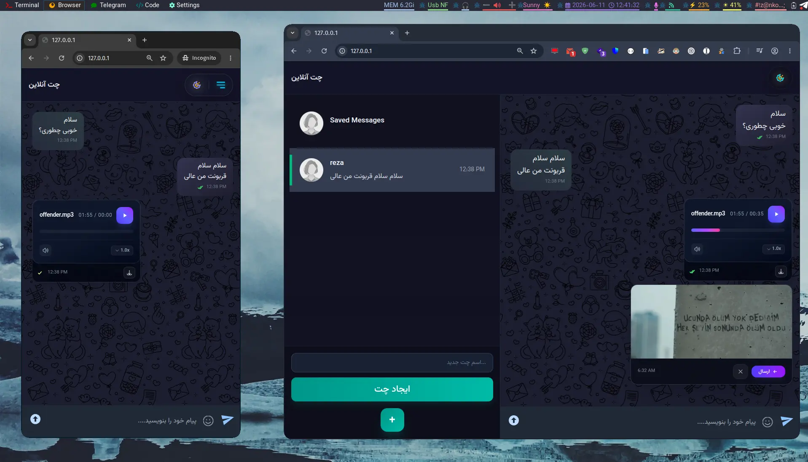

# WaveChat

**WaveChat** is a real-time web-based chat application built with **Django**.
Created in Iran during the internet blackout to help me stay connected with my friends. It started as a simple SSE-based chat and gradually evolved into a real-time messaging platform using **WebSockets** and **Django Channels**


---

## Screenshots



---

## ✨ Key Features
- **Real-time Messaging** — **Django Channels** & **ASGI** with **Redis** as a channel layer for low-latency communication.
- **Presence Tracking**: Tracks online/offline status and delivers read receipts
- **Multi-room Support** — Allows users to chat in different rooms with efficient state management.
- **Authentication** —  Custom API views for user registration and session management
- **Rich Interactions & UX**— Includes Telegram-style emoji reactions, a reply system with navigation, and a fully responsive design with Dark/Light mode.

---


## 🚀 Quick Start
### Development
```
docker-compose -f docker-compose.dev.yml up
```

### Production
```
docker-compose -f docker-compose.prod.yml up -d
```


---


## 🌐 Deployment Note
This project assumes **SSL termination happens at the CDN/Edge level** (such as Cloudflare). Internal traffic between the edge and the application server runs over HTTP.

---

## Future Plans

- [ ] Voice message support
- [ ] OAuth with Google
- [ ] Local or remote object storage
- [ ] End-to-end encryption
